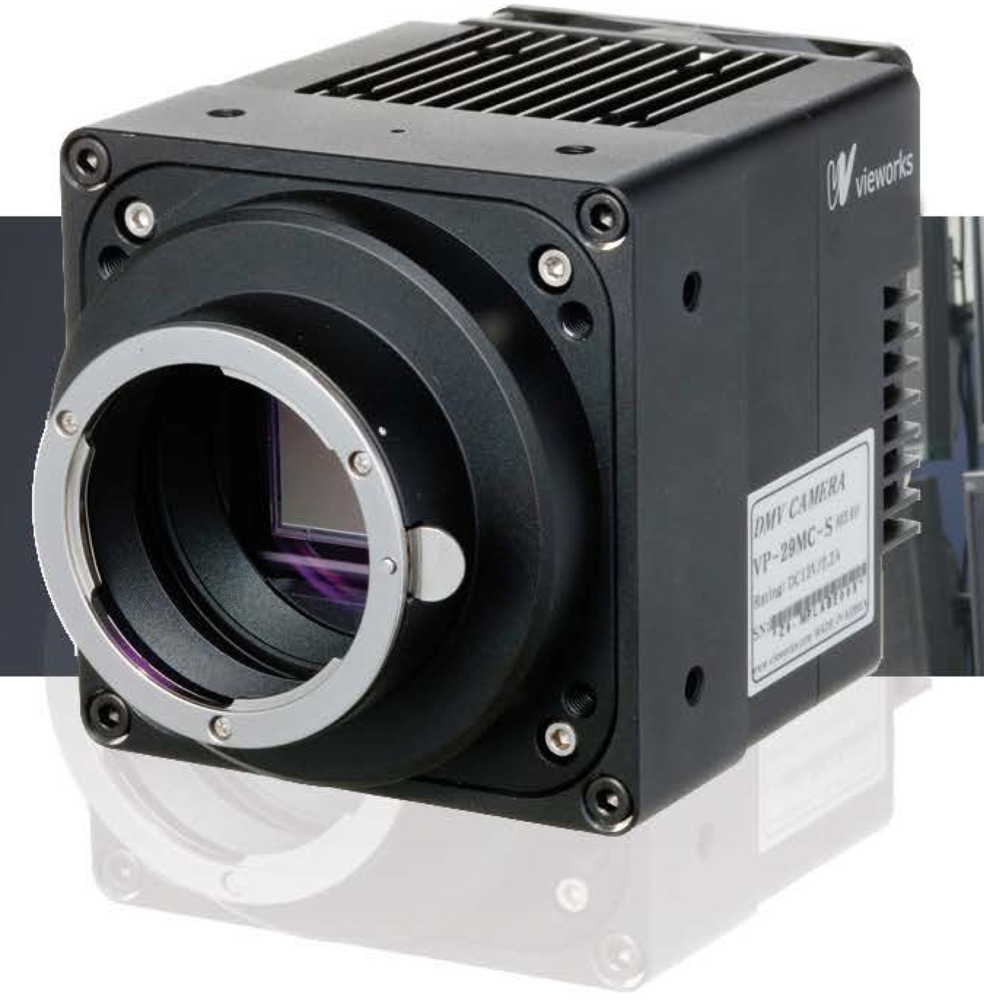

Vieworks-VP
-------



Intoduction
```````````
CAUTION : This documentation is currently a placeholder and needs to be constructed !!!

.....

The Lima module as been tested only with this cameras models:
  - VP 29M (3-tap Camera Link, Linux OS, with a Silicon Software MicoEnable IV frame grabber me4 VD4CL)

Module configuration
````````````````````
Previously to this you have to install ....

Vieworks-VP python module needs at least the lima core module.

The best before using this Lima pluggin with a ....

The minimum configuration file is *config.inc* :

.. code-block:: sh

  COMPILE_CORE=1
  COMPILE_SIMULATOR=0
  COMPILE_SPS_IMAGE=1
  COMPILE_ESPIA=0
  COMPILE_FRELON=0
  COMPILE_MAXIPIX=0
  COMPILE_PILATUS=0
  COMPILE_BASLER=0
  COMPILE_ANDOR=0
  COMPILE_ANDOR3=0
  COMPILE_SISO_ME4=1
  COMPILE_VIEWORKS_VP=1
  COMPILE_CBF_SAVING=0
  export COMPILE_CORE COMPILE_SPS_IMAGE COMPILE_SIMULATOR \
         COMPILE_ESPIA COMPILE_FRELON COMPILE_MAXIPIX COMPILE_PILATUS \
         COMPILE_BASLER COMPILE_ANDOR COMPILE_ANDOR3 COMPILE_CBF_SAVING


See :ref:`Compilation`

Installation
`````````````

- After installing XXX and XXX modules :ref:`installation`

- And probably Tango server :ref:`tango_installation`

Configuration
`````````````

- Still to be written.
